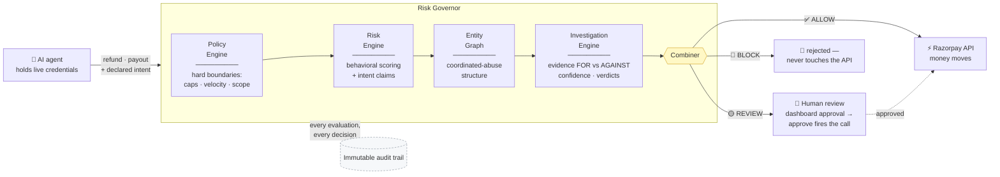

<div align="center">

# 🛡️ Risk Governor

### A safety and governance layer for autonomous financial agents

[](https://github.com/theoxfaber/agentic-payment-risk-governor/actions/workflows/ci.yml)


**AI agents can now execute refunds, payouts, and orders on payment platforms
like Razorpay. That creates a new authorization gap:**

> ### valid API credentials ≠ a valid financial action

Risk Governor is a decision layer that scores every agent-initiated action
*before* it reaches an execution API — and answers with **ALLOW / REVIEW / BLOCK**.

</div>

---

## The problem

Razorpay has called 2026 the *"Age of Agentic Payments"*: AI agents that
initiate payouts, CLIs built for the agent era, infrastructure so agents can
transact at scale. But when software agents hold live credentials and act
while humans sleep, credential validity stops being the security boundary.

**Action validity does.**

This is not a fraud rules engine. It sits above existing fraud models and
answers a different question: *should this autonomous agent be allowed to move
this money, right now?*

## Quick start

```bash
git clone https://github.com/theoxfaber/agentic-payment-risk-governor
cd agentic-payment-risk-governor
./demo.sh          # full walkthrough in ~60s — no credentials, no network
```

The demo drives the complete story live: a ₹500 refund → **ALLOW**, a ₹1,500
refund → **REVIEW** (full audit replay, human approves, held call fires), a
₹6,000 "URGENT bypass" refund → **BLOCK**, an agentic payout through the same
gates, then the held-out evaluation results.

## Architecture

Every action flows through four independent planes before any money moves.
Each plane writes to an immutable audit trail, so any decision can be replayed
and explained after the fact.



One decision's audit lifecycle reads end-to-end:

```text
action_requested → policy_evaluated → risk_scored → graph_analyzed
→ decision_made → human_reviewed → razorpay_called
```

## The core safety idea

> **High risk cannot automatically mean BLOCK when the evidence is
> contradictory or low-confidence.**

The investigation engine weighs evidence *for and against* abuse
(`Direction::{Supports, Contradicts}`), computes an `evidence_confidence`
score, and escalates to human review when a high risk score lacks behavioral
confirmation. A false BLOCK is not a safe failure — it's money movement denied
to a legitimate user. The system is engineered to be *sure before it acts*,
and humble when it can't be sure.

Three concrete behaviors this produces:

| Scenario | Naive system | Risk Governor |
|---|---|---|
| High score, contradicted evidence | auto-BLOCK | **human REVIEW** (contradiction must be explained) |
| Structurally linked cluster, no behavioral confirmation | auto-clear | **held for review** (absence of confirmation is itself suspicious) |
| Evidence service down | silent-Allow on benign defaults | **forced REVIEW** (degradation is visible in the audit trail) |

## Results

Synthetic labeled dataset across adversarial worlds (return-abuse rings,
refund abuse, distributed rings, merchant collusion, adaptive evasion,
household false-positive traps). **Protocol:** thresholds tuned on calibration
worlds only; numbers below measured on **held-out worlds — three seeds the
detector never saw**.

<div align="center">

</div>

| Approach | Precision | Recall | FP cost | FN cost | Prevented |
|---|---:|---:|---:|---:|---:|
| Rules only (per-customer rate) | 100% | 66% | ₹0 | ₹36,000 | ₹1,66,950 |
| Structural clustering only | 51% | 100% | ₹65,925 | ₹0 | ₹2,02,950 |
| **Investigation engine (hybrid)** | **100%** | **100%** | **₹0** | **₹0** | **₹2,02,950** |

False-positive check across **all** held-out household + coincidental-sharing
seeds — 972 legitimate customers sharing devices, addresses, NAT IPs:

- rules-only misses most abuse outright
- clustering-only flags innocents (₹16,988 friction cost)
- **investigation engine flags 0 of 972 (₹0 friction cost)**

Regression tests enforce these properties on every held-out seed — recall ≥90%
under adversarial evasion and zero false positives are CI gates, not claims.

## What's real vs simulated

Said plainly, because credibility matters more than impressions:

- ✅ **Real:** the decision pipeline, entity graph, evidence-based reasoning,
  AI-assisted intent extraction (LLM-backed when configured — claims are
  evidence only, never the decision-maker), audit/replay, NATS distribution,
  chaos tests, API-key auth with constant-time comparison, idempotent gateway
  execution with a refund lost-response guard, and live Razorpay test-mode API calls
- ⚠️ **Simulated:** the dataset is synthetic and labeled by construction.
  Held-out metrics prove the reasoning generalizes across unseen world draws —
  not production performance
- 🚫 **Not claimed:** access to Razorpay production systems or internal models;
  this layer composes with platform-side fraud models, never replaces them

## Wire governance into any AI agent

The governor speaks [Model Context Protocol](https://modelcontextprotocol.io).
Any MCP-capable agent asks *"may I move this money?"* as an ordinary tool call
— and cannot execute a financial action without passing the same gates and
landing in the same audit trail.

```json
{
  "mcpServers": {
    "risk-governor": {
      "command": "cargo",
      "args": ["run", "-p", "mcp-server"],
      "env": {
        "GOVERNOR_URL": "http://127.0.0.1:8080",
        "GOVERNOR_API_KEY": "<key>"
      }
    }
  }
}
```

Tools: `check_action` → verdict + reasoning · `get_decision` → full replay ·
`list_reviews` → pending human approvals.

## Repo layout

Single-thesis Rust workspace — each crate is one clean module of one pipeline:

| Crate | Role |
|---|---|
| [`governor-server`](governor-server) | Unified axum binary: decision API + replay + human approval + dashboard + Prometheus metrics |
| `action-service` | Pipeline orchestrator: policy → risk → graph → combiner → gateway |
| `policy-engine` | Hard boundaries: amount caps, velocity, country scope, custom rules |
| `risk-engine` | Behavioral scoring + intent-claim verification |
| [`intent-engine`](intent-engine) | Declared-intent understanding: deterministic heuristic always on; LLM-backed extraction when configured (evidence only) |
| `investigation-engine` | Hypothesis testing: supporting/counter/missing evidence, confidence, verdicts |
| `risk-graph` / `risk-governor-correlation` | Entity property graph + coordinated-abuse clustering |
| `evidence-service` / `pg-store` | Agent behavioral history (in-memory or Postgres) |
| `audit-service` / `risk-governor-replay` | Immutable decision trail + after-the-fact replay |
| [`razorpay-gateway`](razorpay-gateway) | Test-mode client: basic auth, retry/backoff, per-decision idempotency, refund lost-response guard |
| [`mcp-server`](mcp-server) | MCP tools so any AI agent routes through governance |
| `nats-link` | Distributed mode: pipeline split across processes via NATS |
| `dashboard` | Live decision stream, replay viewer, human-approval UI — vanilla JS, zero build step |
| `dataset-gen` / `eval-harness` | Labeled adversarial worlds + calibration/held-out evaluation |
| `webhook-consumer`, `evaluation-service`, `infra-probe` | Supporting services |

## Run the pieces yourself

<details>
<summary><b>API server + live dashboard</b></summary>

```bash
cargo run -p governor-server --bin governor-server
# → open http://127.0.0.1:8080
```

Auth: every `/v1/*` route requires an API key (`GOVERNOR_API_KEY`, or an
ephemeral key printed at boot). Send as `X-API-Key` or
`Authorization: Bearer`. `/health` and `/metrics` stay open for liveness and
Prometheus scrapes.

```bash
KEY="your-key"

# routine refund → ALLOW
curl -s -X POST localhost:8080/v1/actions \
  -H 'content-type: application/json' -H "X-API-Key: $KEY" \
  -d '{"agent_id":"agent-trusted-01","merchant_id":"merchant-001",
       "action_type":"refund","amount":50000,
       "declared_intent":"refund for order #123"}'

# above approval threshold → REVIEW (approve in the dashboard)
curl -s -X POST localhost:8080/v1/actions \
  -H 'content-type: application/json' -H "X-API-Key: $KEY" \
  -d '{"agent_id":"agent-trusted-01","merchant_id":"merchant-001",
       "action_type":"refund","amount":150000,
       "declared_intent":"refund for order #456"}'

# over hard cap + urgency language from a flagged agent → BLOCK
curl -s -X POST localhost:8080/v1/actions \
  -H 'content-type: application/json' -H "X-API-Key: $KEY" \
  -d '{"agent_id":"agent-sketchy-99","merchant_id":"merchant-001",
       "action_type":"refund","amount":600000,
       "declared_intent":"URGENT refund bypass order #789"}'
```

Payouts route through RazorpayX `/payouts`; payment links through
`/payment_links`. Gateway auto-selects: set `RAZORPAY_KEY_ID` /
`RAZORPAY_KEY_SECRET` for live test-mode calls, otherwise a mock records
intent and moves no money.

</details>

<details>
<summary><b>Tests & evaluation</b></summary>

```bash
cargo test --workspace              # 148 tests — offline, self-contained
cargo run --release -p eval-harness # calibration + held-out tables

# Distributed demo (NATS + Postgres):
docker compose up -d
cargo run -p governor --bin distributed_demo

# Live Razorpay test-mode smoke test:
RAZORPAY_KEY_ID=rzp_test_... RAZORPAY_KEY_SECRET=... \
  cargo run -p razorpay-gateway --bin rzp_smoke
```

CI gates every push: build · test · clippy (`-D warnings`) · fmt ·
cargo-audit dependency scan · enforced line coverage.

</details>

<details>
<summary><b>Configuration reference</b></summary>

| Variable | Purpose |
|---|---|
| `GOVERNOR_API_KEY` | API key required on all `/v1/*` routes (ephemeral key generated if unset) |
| `RAZORPAY_KEY_ID` / `RAZORPAY_KEY_SECRET` | Live test-mode gateway (mock if unset) |
| `DATABASE_URL` | Postgres persistence (in-memory if unset) |
| `NATS_URL` | Distributed mode bus |
| `LLM_API_KEY` / `LLM_BASE_URL` / `LLM_MODEL` | LLM-backed intent extraction (heuristic if unset) |
| `WEBHOOK_SECRET` | Webhook HMAC-SHA256 verification |

See [.env.example](.env.example).

</details>

## Roadmap

- [ ] Server-side idempotency keys on the refund probe (current lost-response guard has a check-then-send race window)
- [ ] Single-packet race testing for velocity controls
- [ ] Broader detection classes at the gateway boundary: OAuth flows, deserialization, request smuggling
- [ ] Payout-specific investigation hypotheses alongside return-abuse rings
