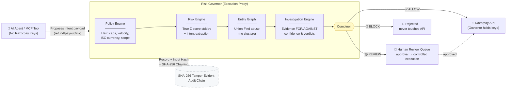
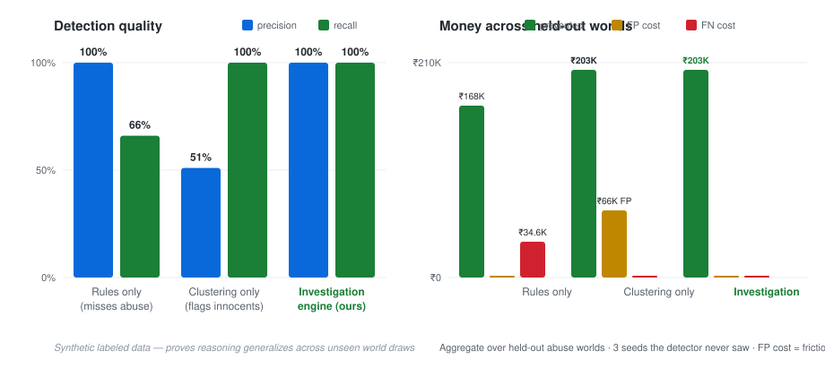

<div align="center">

# 🛡️ Risk Governor

### A safety and governance layer for autonomous financial agents

[](https://github.com/theoxfaber/agentic-payment-risk-governor/actions/workflows/ci.yml)


**AI agents can now execute refunds, payouts, and orders on payment platforms
like Razorpay. That creates a new authorization gap:**

> ### valid API credentials ≠ a valid financial action

Risk Governor is a decision layer that scores every agent-initiated action
*before* it reaches an execution API — and answers with **ALLOW / REVIEW / BLOCK**.

</div>

---

## System Status & Honest Engineering Classification

To maintain absolute architectural transparency, all capabilities in this repository are categorized as follows:

| Classification | Component / Feature | Technical Grounding |
|---|---|---|
| **`[IMPLEMENTED]`** | **Conformal Risk Control (`eval-harness`)** | Pure-Rust CRC split-conformal predictor with declared finite-sample loss bounds ($\alpha_{leak} \le 2\%$). |
| **`[IMPLEMENTED]`** | **Tamper-Evident Audit Chain (`audit-service`)** | Running SHA-256 hash chain (`previous_hash` $\to$ `current_hash`) with canonical key-sorted JSON byte serialization. |
| **`[IMPLEMENTED]`** | **Strict Serde Input Validation (`risk-governor-types`)** | `#[serde(deny_unknown_fields)]` actively rejects key-injection payloads at deserialization. |
| **`[IMPLEMENTED]`** | **Union-Find Graph Clusterer (`risk-graph`)** | Transitive entity link merger detecting coordinated return abuse rings across shared devices/addresses. |
| **`[TEST-MODE]`** | **Razorpay Gateway Proxy (`razorpay-gateway`)** | Dispatches authorized actions to live Razorpay Test Mode endpoints (`/v1/refunds`, `/v1/payouts`, `/v1/payment_links`). |
| **`[TEST-MODE]`** | **Lost-Response Receipt Probe (`razorpay-gateway`)** | Queries Razorpay receipt list before retrying 5xx gateway timeouts to prevent double-refunds. |
| **`[DESIGN GUARANTEE]`** | **Execution Proxy Trust Boundary** | AI Agents hold **zero** Razorpay secret keys. Credentials exist strictly in `governor-server`, forming a non-bypassable proxy gate. |
| **`[SIMULATED]`** | **Synthetic Adversarial Dataset (`dataset-gen`)** | Generates 6 adversarial multi-world sweeps (refund rings, return abuse, merchant collusion) for offline evaluation. |
| **`[LIMITATION]`** | **Supported Currency Allowlist** | Validates ISO-style currency codes against an explicit supported allowlist (`INR`, `USD`, `EUR`, `GBP`, `SGD`, `AED`, `AUD`, `CAD`), not an offline ISO 4217 database. |

---

## The problem

Razorpay has called 2026 the *"Age of Agentic Payments"*: AI agents that
initiate payouts, CLIs built for the agent era, infrastructure so agents can
transact at scale. But when software agents act while humans sleep, granting
agents direct, un-monitored access to live financial API keys creates severe loss risk.

**Risk Governor solves this via an Execution Proxy Trust Boundary:**
- **The AI Agent does NOT hold Razorpay API secret keys.** It interacts solely with the Governor's decision layer via restricted MCP tools or `/v1/actions`.
- **The Risk Governor holds the Razorpay API credentials** (`RAZORPAY_KEY_ID` / `RAZORPAY_KEY_SECRET`).
- An agent proposes an action intent payload; the Governor evaluates it against Policy, Risk, Graph, and Investigation planes; and **ONLY if evaluated as ALLOW (or approved via Human Review)** does the Governor execute the call against Razorpay APIs.

This sits above existing fraud models and answers the fundamental question: *should this autonomous agent be allowed to move this money, right now?*

## Quick start

```bash
git clone https://github.com/theoxfaber/agentic-payment-risk-governor
cd agentic-payment-risk-governor
./demo.sh          # full walkthrough in ~60s — no credentials, no network
```

The demo drives the complete story live: a ₹500 refund → **ALLOW**, a ₹1,500
refund → **REVIEW** (full audit replay, human approves, held call fires), a
₹6,000 "URGENT bypass" refund → **BLOCK**, an agentic payout through the same
gates, then the held-out evaluation results.

## Architecture

Every action flows through four independent planes before any money moves.
Each plane writes to an immutable audit trail, so any decision can be replayed
and explained after the fact.



One decision's audit lifecycle reads end-to-end:

```text
action_requested → policy_evaluated → risk_scored → graph_analyzed
→ decision_made → human_reviewed → razorpay_called
```

## The core safety idea

> **High risk cannot automatically mean BLOCK when the evidence is
> contradictory or low-confidence.**

The investigation engine weighs evidence *for and against* abuse
(`Direction::{Supports, Contradicts}`), computes an `evidence_confidence`
score, and escalates to human review when a high risk score lacks behavioral
confirmation. A false BLOCK is not a safe failure — it's money movement denied
to a legitimate user. The system is engineered to be *sure before it acts*,
and humble when it can't be sure.

Three concrete behaviors this produces:

| Scenario | Naive system | Risk Governor |
|---|---|---|
| High score, contradicted evidence | auto-BLOCK | **human REVIEW** (contradiction must be explained) |
| Structurally linked cluster, no behavioral confirmation | auto-clear | **held for review** (absence of confirmation is itself suspicious) |
| Evidence service down | silent-Allow on benign defaults | **forced REVIEW** (degradation is visible in the audit trail) |

## Results

Synthetic labeled dataset across adversarial worlds (return-abuse rings,
refund abuse, distributed rings, merchant collusion, adaptive evasion,
household false-positive traps). **Protocol:** thresholds tuned on calibration
worlds only; numbers below measured on **held-out worlds — three seeds the
detector never saw**.

<div align="center">

</div>

| Approach | Precision | Recall | FP cost | FN cost | Prevented |
|---|---:|---:|---:|---:|---:|
| Rules only (per-customer rate) | 100% | 66% | ₹0 | ₹34,650 | ₹1,68,300 |
| Structural clustering only | 51% | 100% | ₹65,925 | ₹0 | ₹2,02,950 |
| **Investigation engine (hybrid)** | **100%** | **100%** | **₹0** | **₹0** | **₹2,02,950** |
| Learned logistic regression | 100% | 100% | ₹0 | ₹0 | ₹2,02,950 |
| LR + conformal economics (`calibrated_lr_crc`) | 100% | 94% | ₹0 | ₹1,350 | ₹2,01,600 |

The last two rows are a pure-Rust logistic regression trained **only on
calibration worlds** — held-out numbers. The calibrated variant concedes
₹1,350 of prevented value *on purpose*: it auto-allows only when being wrong
costs less than one ₹400 human review (`p̂ × exposure ≤ review_cost`), and its
auto-block threshold comes from [Conformal Risk Control](docs/AI_DESIGN.md)
with declared budgets — fraud-leak ≤ 2%, friction ≤ 1%, finite-sample valid.
Spending human time to prevent ₹13.50 is bad economics, and the system can
say so with a number instead of a vibe.

False-positive check across **all** held-out household + coincidental-sharing
seeds — 972 legitimate customers sharing devices, addresses, NAT IPs:

- rules-only misses most abuse outright
- clustering-only flags innocents (₹16,988 friction cost)
- investigation engine, learned LR, and the CRC-calibrated detector each flag **0 of 972**

Regression tests enforce these properties on every held-out seed — recall ≥90%
under adversarial evasion and zero false positives are CI gates, not claims.

### What breaks first when the data gets messy

The table above is *clean-data* performance. Real evidence pipelines degrade:
behavioral records go missing, timestamps drift, event counters are noisy.
Rather than pretend otherwise, the harness degrades held-out worlds along
those axes and measures it (`cargo run --release -p eval-harness` prints the
full sweep):

| Mess level | Precision | Recall | Legit customers flagged | Human-review share |
|---|---:|---:|---:|---:|
| clean | 100% | 100% | **0** of 2,136 | 1% |
| mild (10% missing data, ±12h jitter) | 100% | 100% | 3 of 1,929 | 30% |
| heavy (30% missing, ±48h jitter, count noise) | 100% | 100% | **24** of 1,519 | 72% |

Read honestly, this shows both the strength and the cost of the design:

- **Recall never collapses** — even with 30% of evidence missing, no abuser is
  silently cleared, because falling confidence escalates to humans instead of
  guessing (review share climbs 1% → 72%). That is the core safety property
  working under stress.
- **The bill moves to friction and workload** — legitimate customers start
  getting flagged (0 → 24, ~1.6%) and human reviewers carry more load. In a
  real deployment those are the tuning knobs you'd watch, and this harness is
  how you'd watch them.

And because "100% on your own templates" proves little, the sweep also draws
**140 randomly-parameterized worlds** (population size, ring count, ring size
never tuned against):

> investigation engine across 140 randomly-drawn worlds:
> **precision 100%, recall 99.4%** — legitimate-world false positives pooled
> into the headline, 0 flagged

Not perfect — one ring in a few hundred slips through when random draws
produce near-evasion shapes. That gap is a more credible number than another
clean 100%.

**CRC guarantee validation — clean tables don't exercise the bound.** Calibrating
on clean, separable worlds leaves the conformal budgets unconsumed. `stress.rs`
camouflages abusers toward the legitimate manifold and re-calibrates per run;
over 12 fresh runs the pooled leak and friction sit *on* their budgets
(≈2% and ≈1%, z < 1 within binomial noise) while review share inflates ~2→36%
and PSI fires at ~1.0 — the designed conservative response. Details, including
the mixture-mismatch that first violated the bound (87% leak when cohort and
deployment mixtures differed), in [docs/AI_DESIGN.md §2.6](docs/AI_DESIGN.md).

The full methodology — why logistic regression, why an LLM never decides,
how the conformal budgets work, and the production label-maturation path —
is in [docs/AI_DESIGN.md](docs/AI_DESIGN.md).

## What's real vs simulated

Said plainly, because credibility matters more than impressions:

- ✅ **Real:** the decision pipeline, entity graph, evidence-based reasoning,
  a **learned scoring layer** (pure-Rust logistic regression trained on
  calibration worlds only, thresholds calibrated by Conformal Risk Control
  with declared fraud-leak/friction budgets — see docs/AI_DESIGN.md),
  AI-assisted intent extraction (LLM-backed when configured, prompt-injection
  hardened — claims are evidence only, never the decision-maker), audit/replay,
  NATS distribution, chaos tests, API-key auth with constant-time comparison,
  idempotent gateway execution with a refund lost-response guard,
  PSI drift monitoring, and live Razorpay test-mode API calls
- ⚠️ **Simulated:** the dataset is synthetic and labeled by construction.
  Held-out metrics, randomized-parameter sweeps, and degradation tests prove
  the reasoning generalizes across unseen world draws and messy data — not
  production performance. The learned layer's training/calibration data is
  synthetic; wiring it to matured production labels (via Razorpay webhooks)
  is the stated next milestone. No claim of access to Razorpay's production
  risk systems or internal models
- 🚫 **Not claimed:** access to Razorpay production systems or internal models;
  this layer composes with platform-side fraud models, never replaces them

## Wire governance into any AI agent

The governor speaks [Model Context Protocol](https://modelcontextprotocol.io).
Any MCP-capable agent asks *"may I move this money?"* as an ordinary tool call
— and cannot execute a financial action without passing the same gates and
landing in the same audit trail.

```json
{
  "mcpServers": {
    "risk-governor": {
      "command": "cargo",
      "args": ["run", "-p", "mcp-server"],
      "env": {
        "GOVERNOR_URL": "http://127.0.0.1:8080",
        "GOVERNOR_API_KEY": "<key>"
      }
    }
  }
}
```

Tools: `check_action` → verdict + reasoning · `get_decision` → full replay ·
`list_reviews` → pending human approvals.

## Repo layout

Single-thesis Rust workspace — each crate is one clean module of one pipeline:

| Crate | Role |
|---|---|
| [`governor-server`](governor-server) | Unified axum binary: decision API + replay + human approval + dashboard + Prometheus metrics |
| `action-service` | Pipeline orchestrator: policy → risk → graph → combiner → gateway |
| `policy-engine` | Hard boundaries: amount caps, velocity, country scope, custom rules |
| `risk-engine` | Behavioral scoring + intent-claim verification |
| [`intent-engine`](intent-engine) | Declared-intent understanding: deterministic heuristic always on; LLM-backed extraction when configured (evidence only) |
| `investigation-engine` | Hypothesis testing: supporting/counter/missing evidence, confidence, verdicts |
| `risk-graph` / `risk-governor-correlation` | Entity property graph + coordinated-abuse clustering |
| `evidence-service` / `pg-store` | Agent behavioral history (in-memory or Postgres) |
| `audit-service` / `risk-governor-replay` | Immutable decision trail + after-the-fact replay |
| [`razorpay-gateway`](razorpay-gateway) | Test-mode client: basic auth, retry/backoff, per-decision idempotency, refund lost-response guard |
| [`mcp-server`](mcp-server) | MCP tools so any AI agent routes through governance |
| `nats-link` | Distributed mode: pipeline split across processes via NATS |
| `dashboard` | Live decision stream, replay viewer, human-approval UI — vanilla JS, zero build step |
| `dataset-gen` / `eval-harness` | Labeled adversarial worlds + calibration/held-out evaluation; learned layer (`lr`, `conformal`, `learned`) trained on calibration worlds only |
| `webhook-consumer`, `evaluation-service`, `infra-probe` | Supporting services |

Design docs: [docs/AI_DESIGN.md](docs/AI_DESIGN.md) (intelligence-layer
architecture and references) · [docs/BUGS.md](docs/BUGS.md) (every real bug
hit, how it was caught, how it's pinned) · [docs/TESTING.md](docs/TESTING.md).

## Run the pieces yourself

<details>
<summary><b>API server + live dashboard</b></summary>

```bash
cargo run -p governor-server --bin governor-server
# → open http://127.0.0.1:8080
```

Auth: every `/v1/*` route requires an API key (`GOVERNOR_API_KEY`, or an
ephemeral key printed at boot). Send as `X-API-Key` or
`Authorization: Bearer`. `/health` and `/metrics` stay open for liveness and
Prometheus scrapes.

```bash
KEY="your-key"

# routine refund → ALLOW
curl -s -X POST localhost:8080/v1/actions \
  -H 'content-type: application/json' -H "X-API-Key: $KEY" \
  -d '{"agent_id":"agent-trusted-01","merchant_id":"merchant-001",
       "action_type":"refund","amount":50000,
       "declared_intent":"refund for order #123"}'

# above approval threshold → REVIEW (approve in the dashboard)
curl -s -X POST localhost:8080/v1/actions \
  -H 'content-type: application/json' -H "X-API-Key: $KEY" \
  -d '{"agent_id":"agent-trusted-01","merchant_id":"merchant-001",
       "action_type":"refund","amount":150000,
       "declared_intent":"refund for order #456"}'

# over hard cap + urgency language from a flagged agent → BLOCK
curl -s -X POST localhost:8080/v1/actions \
  -H 'content-type: application/json' -H "X-API-Key: $KEY" \
  -d '{"agent_id":"agent-sketchy-99","merchant_id":"merchant-001",
       "action_type":"refund","amount":600000,
       "declared_intent":"URGENT refund bypass order #789"}'
```

Payouts route through RazorpayX `/payouts`; payment links through
`/payment_links`. Gateway auto-selects: set `RAZORPAY_KEY_ID` /
`RAZORPAY_KEY_SECRET` for live test-mode calls, otherwise a mock records
intent and moves no money.

</details>

<details>
<summary><b>Tests & evaluation</b></summary>

```bash
cargo test --workspace              # 185 tests — offline, self-contained (see docs/TESTING.md)
cargo run --release -p eval-harness # calibration + held-out tables + CRC guarantee validation

# Judge-regenerable headline: your own held-out seeds, never seen by this repo
EVAL_HELDOUT_SEEDS=12345,67890 cargo run --release -p eval-harness

# Distributed demo (NATS + Postgres):
docker compose up -d
cargo run -p governor --bin distributed_demo

# Live Razorpay test-mode smoke test:
RAZORPAY_KEY_ID=rzp_test_... RAZORPAY_KEY_SECRET=... \
  cargo run -p razorpay-gateway --bin rzp_smoke
```

CI gates every push: build · test · clippy (`-D warnings`) · fmt ·
cargo-audit dependency scan · enforced line coverage.

</details>

<details>
<summary><b>Configuration reference</b></summary>

## Configuration reference

| Variable | Purpose |
|---|---|
| `GOVERNOR_API_KEY` | API key required on all `/v1/*` routes (ephemeral key generated if unset) |
| `RAZORPAY_KEY_ID` / `RAZORPAY_KEY_SECRET` | Live test-mode gateway (mock if unset) |
| `DATABASE_URL` | Postgres persistence (in-memory if unset) |
| `NATS_URL` | Distributed mode bus |
| `LLM_API_KEY` / `LLM_BASE_URL` / `LLM_MODEL` | LLM-backed intent extraction (heuristic if unset; prompt-injection hardened) |
| `WEBHOOK_SECRET` | Webhook HMAC-SHA256 verification |
| `SEED_DEMO` | With Postgres: opt-in (`true`/`1`) demo entity seeding — never implicit in production DBs |
| `SCORE_REFERENCE_JSON` | 5-bucket risk-score reference distribution → exports PSI drift metric at `/metrics` |

See [.env.example](.env.example).

</details>

## Roadmap

- [ ] Label maturation loop: Razorpay dispute/refund webhooks → `OutcomeRecorded` training table → nightly retrain of the learned layer, gated by PSI + held-out metrics (docs/AI_DESIGN.md §4)
- [ ] Server-side idempotency keys on the refund probe (Razorpay's native `X-Refund-Idempotency` header; current lost-response guard has a check-then-send race window)
- [ ] Single-packet race testing for velocity controls
- [ ] Dispute Responder: two-phase `draft → submit` contest flow against `/v1/disputes/:id/contest` behind the same human-approval gate
- [ ] Segment-level conformal recalibration (new-account vs established cohorts) for conditional guarantee coverage
- [ ] Payout-specific investigation hypotheses alongside return-abuse rings
