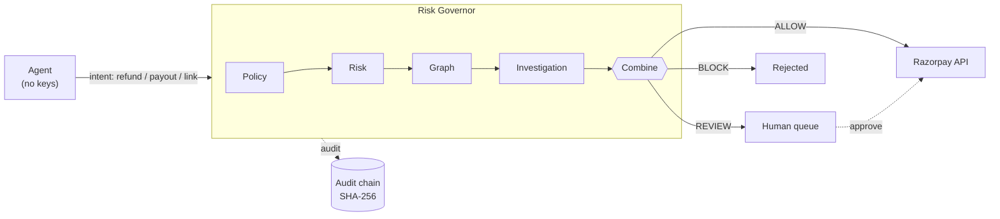

# Risk Governor

**A safety layer for AI agents that move money.**

Agents with live Razorpay keys can refund, payout, and create orders while humans are asleep. Credential validity stops being the right check — *action validity* does.

Risk Governor sits in front of the gateway and answers one question for every agent intent: **ALLOW · REVIEW · BLOCK**. Nothing touches Razorpay unless it passes.

<p>
  <a href="https://github.com/theoxfaber/agentic-payment-risk-governor/actions/workflows/ci.yml"></a>
  
  
  
</p>

---

## Why this exists

Razorpay calls 2026 the "Age of Agentic Payments." Agents will initiate payouts, build checkouts, and operate on financial rails at machine speed.

That creates a gap: **valid API credentials ≠ valid financial action**. An agent can be authenticated and still be wrong — wrong amount, wrong payment state, wrong intent, duplicated by a retry.

Risk Governor is a non-bypassable proxy. The agent never sees the Razorpay secret. It proposes an intent; the governor checks it; only then does money move. Every check is logged in a tamper-evident chain you can replay later.

---

## 60-second demo

No keys, no network, no setup.

```bash
git clone https://github.com/theoxfaber/agentic-payment-risk-governor
cd agentic-payment-risk-governor
./demo.sh
```

What it shows:

- **₹500 refund** → ALLOW — executes, writes audit hash
- **₹1,500 refund** → REVIEW — parks for human approval, replay the trail, approve → executes
- **₹6,000 “URGENT bypass”** → BLOCK — never touches the API
- **Payout** through the same gates
- **Held-out evaluation** — the numbers below, recomputed live

Dashboard at `http://127.0.0.1:8080` shows the decision stream, full replay, and a one-click approve. Metrics at `/metrics`.

---

## How it works

Four independent planes, one combiner. Every plane writes to the same audit log.



| Plane | What it checks | Fails how |
| --- | --- | --- |
| **Policy** | Caps, velocity, country allow/deny, custom rules, payment state (`captured` + paise balance) | Hard BLOCK |
| **Risk** | Amount and velocity z-scores (true stddev), drift, agent history, intent mismatch | Score 0–1 |
| **Graph** | Union-find over shared device/address/instrument → abuse rings | Cluster + resources |
| **Investigation** | For vs. against evidence, confidence, verdict (Supported / Conflicted / Unsupported) | Review when unsure |

**Core rule:** high risk never means auto-block when evidence is contradictory or thin. Contradiction → REVIEW. No behavioral confirmation for a structural link → REVIEW. Evidence service down → REVIEW. Being sure matters more than being fast.

Audit event chain: `action_requested → policy_evaluated → risk_scored → graph_analyzed → decision_made → human_reviewed → razorpay_called`

Every record is canonical-JSON → SHA-256 chained (`previous_hash → current_hash`). Input hash covers the full intent so tampering is visible.

---

## Results — held-out only

All thresholds are tuned on calibration worlds (seed 2026). The table below is measured on **three held-out seeds the detector never saw**.

<p align="center">
  
</p>

| Approach | Precision | Recall | FP cost | FN cost | Prevented |
| --- | --- | --- | --- | --- | --- |
| Per-customer rate rule | 100% | 66% | ₹0 | ₹34,650 | ₹1,68,300 |
| Structural clustering only | 51% | 100% | ₹65,925 | ₹0 | ₹2,02,950 |
| **Investigation engine** | **100%** | **100%** | **₹0** | **₹0** | **₹2,02,950** |
| Learned logistic (pure Rust) | 100% | 100% | ₹0 | ₹0 | ₹2,02,950 |
| LR + conformal economics | 100% | 94% | ₹0 | ₹1,350 | ₹2,01,600 |

The last row is intentional. It only auto-allows when being wrong costs less than a human review (`p̂ × exposure ≤ ₹400`). Conceding ₹1,350 is cheaper than spending ₹400 of reviewer time to prevent ₹13.50 — and the system reports that tradeoff as a number, not a feeling. Auto-block threshold comes from Conformal Risk Control (fraud-leak ≤ 2%, friction ≤ 1%), finite-sample valid. Details in [docs/AI_DESIGN.md](docs/AI_DESIGN.md).

**False positives on 972 legitimate customers** who share devices, addresses, and NAT IPs:

- Rules-only misses most abuse; clustering-only flags 72 of 972 (₹16,988)
- Investigation, learned LR, and calibrated LR each flag **0 of 972**

Regression tests gate these properties on every held-out seed. They are not claims.

### When data gets messy

Real pipelines lose records, clocks drift, counters are noisy. The harness degrades held-out worlds and measures it:

| Condition | Precision | Recall | Legit flagged | To review |
| --- | --- | --- | --- | --- |
| Clean | 100% | 100% | 0 of 2,136 | 1% |
| Mild: 10% missing, ±12h jitter | 100% | 100% | 3 of 1,929 | 30% |
| Heavy: 30% missing, ±48h jitter, count noise | 100% | 100% | 24 of 1,519 | 72% |

Recall holds because uncertainty is routed to humans. The cost moves to workload — the knob you would tune in production, and the harness shows you how.

### Beyond hand-built templates

140 worlds with random population size, ring count, and ring size — never tuned against:

> **investigation engine: 100% precision, 99.4% recall** (legit-world FPs pooled, 0 flagged)

### The conformal bound — tested, not just claimed

Clean worlds are too separable to spend the budgets. `stress.rs` camouflages abusers toward the legit manifold and re-calibrates per run. Over 12 fresh runs (2,616 customers):

- **leaked 53 vs budget 52, z=0.09 — holds**
- **blocked-legit 31 vs budget 26, z=0.95 — holds**
- review share 2% → 36%, PSI ≈ 1.0 fires before any label exists

First attempt that mixed calibration and deployment mixtures violated at 87% — documented as the mixture-mismatch lesson. The harness now requires deployment-matched calibration. See §2.6 in [AI_DESIGN.md](docs/AI_DESIGN.md).

---

## Security properties

- **Credential isolation.** Agents never hold Razorpay keys. Only `governor-server` does. MCP tools and `/v1/actions` are the only entry points.
- **Auth.** `X-API-Key` or `Authorization: Bearer`, constant-time compare (`subtle`). Dashboard carries no secret — key lives in the browser's `sessionStorage`.
- **Audit.** Canonical JSON, SHA-256 hash chain, `deny_unknown_fields` on inputs. Replay reconstructs any decision.
- **Idempotency.** Decision dedup (second `execute()` returns cached response) + deterministic `Idempotency-Key: rfnd_{payment_id}_{decision_id}` on every gateway POST + lost-response guard that probes Razorpay's refund list by `receipt == decision_id` before resending a 5xx. Retries never double-charge.
- **Financial invariants.** All amounts are integer paise (no floats). Refunds require `payment_state == "captured"` and `amount ≤ captured - refunded` (checked subtraction) — over-refund is a policy BLOCK. Validation rejects `amount ≤ 0` and unknown currencies (400, not 500). Custom rules with unknown conditions fail closed.
- **Concurrency.** Approval is claim-under-lock: the REVIEW is removed from the map before the gateway call, so 8 concurrent approvers produce exactly one execution (pinned test). NATS workers exit non-zero on subscribe failure; demo seeding never writes to a Postgres you didn't opt into (`SEED_DEMO=true`).

---

## Using it

### Server + dashboard

```bash
cargo run -p governor-server --bin governor-server
# → http://127.0.0.1:8080   dashboard + API
# → http://127.0.0.1:8080/metrics  Prometheus
```

Auth example:

```bash
KEY="your-key"

# ALLOW
curl -s -X POST localhost:8080/v1/actions \
  -H 'content-type: application/json' -H "X-API-Key: $KEY" \
  -d '{"agent_id":"agent-trusted-01","merchant_id":"merchant-001","action_type":"refund","amount":5000,"declared_intent":"refund order #123","context":{"payment_id":"pay_test","payment_state":"captured","captured_paise":100000}}' | jq .

# REVIEW — approve in dashboard or:
curl -s -X POST localhost:8080/v1/decisions/<id>/approve \
  -H 'content-type: application/json' -H "X-API-Key: $KEY" \
  -d '{"approved":true,"reviewer_id":"analyst-7"}' | jq .

# BLOCK — over balance / hard cap / urgency from flagged agent
curl -s -X POST localhost:8080/v1/actions \
  -H 'content-type: application/json' -H "X-API-Key: $KEY" \
  -d '{"agent_id":"agent-sketchy-99","merchant_id":"merchant-001","action_type":"refund","amount":600000,"declared_intent":"URGENT bypass order #789"}' | jq .
```

Payouts use RazorpayX (`/payouts`), payment links use `/payment_links`. Set `RAZORPAY_KEY_ID` / `RAZORPAY_KEY_SECRET` for live test-mode calls; otherwise a mock records intent.

### Give any agent a guardrail

```json
{
  "mcpServers": {
    "risk-governor": {
      "command": "cargo",
      "args": ["run", "-p", "mcp-server"],
      "env": { "GOVERNOR_URL": "http://127.0.0.1:8080", "GOVERNOR_API_KEY": "<key>" }
    }
  }
}
```

Tools: `check_action` → verdict + reasoning · `get_decision` → full replay · `list_reviews` → queue.

### Demo console

The dashboard at `/dashboard` includes a built-in Demo Console with the four curl snippets above, live counts, and a hint linking to `/metrics` (`gateway_executions_total` must never exceed `allows`). No build step, vanilla JS.

---

## Project map

Each crate is one pipeline stage — easy to read, easy to replace.

| Crate | Does |
| --- | --- |
| `governor-server` | Axum API, replay, approval, dashboard, Prometheus |
| `action-service` | Orchestrator: policy → risk → graph → combiner → gateway |
| `policy-engine` | Caps, velocity, country, payment-state/balance, custom rules |
| `risk-engine` | Z-scores + intent-mismatch scoring |
| `intent-engine` | Heuristic + optional LLM extraction (evidence-only, hardened) |
| `investigation-engine` | For/against evidence, confidence, verdicts |
| `risk-graph` · `risk-governor-correlation` | Property graph + coordinated-abuse clustering |
| `evidence-service` · `pg-store` | History (memory or Postgres) |
| `audit-service` · `risk-governor-replay` | Append-only trail + replay |
| `razorpay-gateway` | Test-mode client, retries, idempotency, lost-response guard |
| `mcp-server` | MCP stdio tools |
| `nats-link` | Split pipeline over NATS |
| `dashboard` | Single-page UI, zero build |
| `dataset-gen` · `eval-harness` | Synthetic worlds + held-out evaluation + learned layer (`lr`, `conformal`, `learned`, `stress`) |

Docs: [AI design](docs/AI_DESIGN.md) · [Bugs hit & fixed](docs/BUGS.md) · [Testing](docs/TESTING.md)

---

## Verify yourself

```bash
cargo test --workspace              # 201 tests, offline, no credentials
cargo run --release -p eval-harness # calibration + held-out + stress validation

# Your own held-out seeds — nothing this repo has seen
EVAL_HELDOUT_SEEDS=12345,67890 cargo run --release -p eval-harness

# Distributed (NATS + Postgres)
docker compose up -d
cargo run -p governor --bin distributed_demo

# Live Razorpay test-mode
RAZORPAY_KEY_ID=rzp_test_... RAZORPAY_KEY_SECRET=... cargo run -p razorpay-gateway --bin rzp_smoke
```

CI on every push: build · test · `clippy -D warnings` · `fmt` · `cargo-audit` · line coverage ≥ 60%.

<details>
<summary>Configuration</summary>

| Variable | What it does |
| --- | --- |
| `GOVERNOR_API_KEY` | Required on `/v1/*` (ephemeral generated if unset) |
| `RAZORPAY_KEY_ID` / `RAZORPAY_KEY_SECRET` | Live test-mode gateway (mock if unset) |
| `DATABASE_URL` | Postgres persistence (memory if unset) |
| `NATS_URL` | Bus for distributed mode |
| `LLM_API_KEY` / `LLM_BASE_URL` / `LLM_MODEL` | LLM extraction (heuristic if unset) |
| `WEBHOOK_SECRET` | HMAC-SHA256 for `X-Razorpay-Signature` |
| `SEED_DEMO` | With Postgres, `true`/`1` to seed demo entities |
| `SCORE_REFERENCE_JSON` | 5-bucket reference for PSI drift gauge at `/metrics` |

See [.env.example](.env.example).

</details>

---

## What's simulated, what's not

- **Real:** decision pipeline, graph, evidence reasoning, learned scorer + conformal budgets (see above), hardened intent extraction, audit/replay, NATS, chaos tests, constant-time auth, idempotent gateway + receipt probe, PSI drift, live Razorpay test-mode calls.
- **Simulated:** the dataset is synthetic. Held-out, random-world, degraded, and stress tests show the reasoning generalizes across unseen draws and messy data — not production performance. Learned weights are trained on synthetic labels; wiring to matured production labels (webhooks → `OutcomeRecorded` → nightly retrain, gated by PSI) is the next milestone.
- **Not claimed:** access to Razorpay production risk systems. This composes with platform-side fraud models, never replaces them.

---

## Roadmap

- Label maturation loop: webhooks → `OutcomeRecorded` → nightly retrain, gated by PSI + held-out metrics
- Single-packet race tests for velocity
- Dispute responder: `draft → submit` against `/v1/disputes/:id/contest` behind the same approval gate
- Segment-level conformal recalibration (new vs. established cohorts)
- Payout-specific investigation hypotheses
